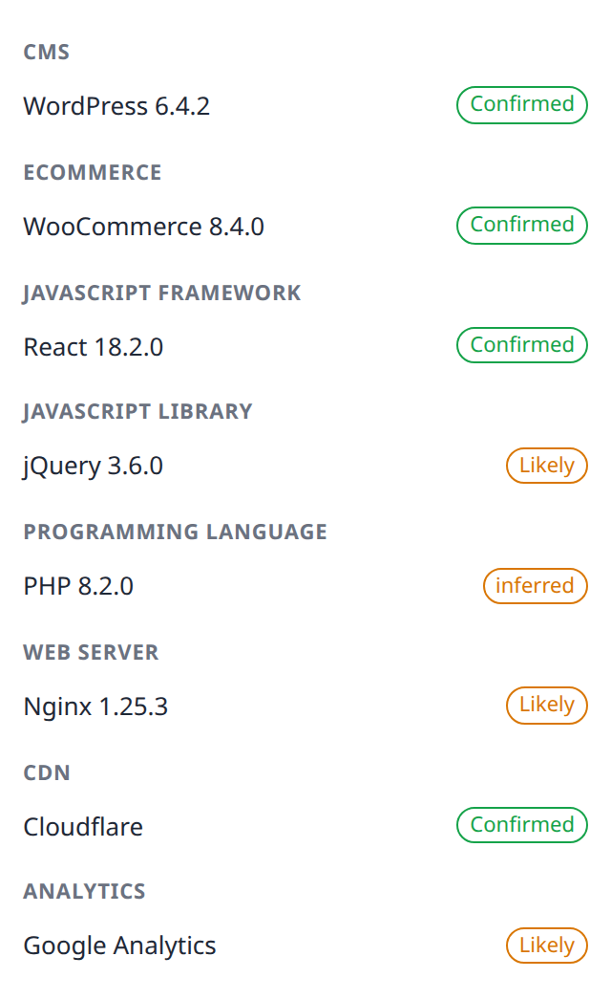

# specio

Chrome/Chromium extension that detects the technologies behind a web page: CMS,
JavaScript frameworks, ecommerce platforms, analytics, tag managers, CDNs, web
servers, languages and more. Detection runs entirely on-device — no network
requests, no account, no telemetry.

[](https://github.com/Glyndor/specio/actions/workflows/ci.yml)

<p align="center">
	
</p>

## Features

- 🔎 **Multi-signal detection.** Each technology is recognised by several
	independent signals — markup, script URLs, meta tags, cookies, headers — never
	one removable marker, so detection survives a hardening plugin hiding a path.
- 🎯 **Confidence, not guesses.** Every result is **confirmed** or **likely**, and
	confidence accumulates as more signals agree — fewer false positives than a
	single-pattern match.
- 🏷️ **Real version detection.** Reports the actual version running on the page,
	cross-checked across sources; if they disagree, it reports the name without a
	version instead of guessing.
- 🔒 **Zero network in the basic tier.** Detection is fully on-device. specio
	makes **no request of its own**, sends nothing anywhere, and has no telemetry —
	a privacy posture you can verify, not just trust.
- 🧩 **Grouped, with the why.** The popup lists the stack by category and can show
	the signal that matched, with a logo per technology.
- 🌍 **Multilingual.** The UI and category names are translated (English and
	Spanish today); technology names stay verbatim.

## Try it (load unpacked)

specio targets the Chrome Web Store; until it is published you can load it from
source:

```sh
bun install
bun run package      # builds and assembles ./dist
```

Then in Chrome: open `chrome://extensions`, enable **Developer mode**, click
**Load unpacked**, and choose the `dist/` folder. Visit any site and the toolbar
badge shows the number of technologies detected; click it for the breakdown.

## Privacy

The basic tier runs entirely on your machine: it reads the page and the response
the browser already received, matches locally, and sends nothing. An optional,
**off-by-default** advanced tier can look up DNS-derived facts (email provider,
SaaS in use, DNS host) — and only ever after you grant a permission. See
[`PRIVACY.md`](PRIVACY.md).

## Tech

TypeScript, Manifest V3, bundled with [Bun](https://bun.sh); the fingerprint
ruleset is authored clean-room and shipped in the extension. Contributions to
the ruleset are welcome — each rule ships with a fixture proving it matches
without false-positiving.

## License

[Apache-2.0](LICENSE).
